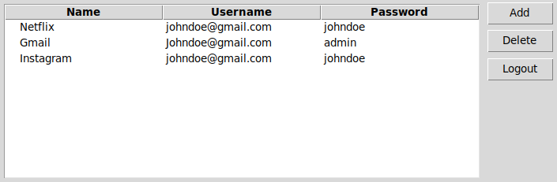
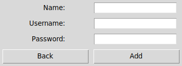

<p align="center">
  <a href="https://github.com/bitVivAZ/PasswordManager/graphs/contributors">
    
  </a>
  <a href="https://github.com/bitVivAZ/PasswordManager/network/members">
    
  </a>
  <a href="https://github.com/bitVivAZ/PasswordManager/stargazers">
    
  </a>
  <a href="https://github.com/bitVivAZ/PasswordManager/repo/issues">
    
  </a>
  <a href="https://github.com/bitvivaz/PasswordManager/blob/master/LICENSE.txt">
    
  </a>
  <a href="https://linkedin.com/in/mbuxmann">
    
  </a>
</p>


<!-- PROJECT LOGO -->
<br />
<p align="center">
  <a href="https://github.com/bitvivaz/PasswordManager">
    
  </a>

  <h3 align="center">Password Manager</h3>

  <p align="center">
    A place to manage and store your passwords
    <br />
    <a href="#table-of-contents"><strong>Explore the docs »</strong></a>
    <br />
    <br />
    <a href="https://github.com/bitvivaz/PasswordManager/issues">Report Bug</a>
    ·
    <a href="https://github.com/bitvivaz/PasswordManager/issues">Request Feature</a>
  </p>
</p>


<!-- TABLE OF CONTENTS -->
## Table of Contents

* [About the Project](#about-the-project)
  * [Built With](#built-with)
* [Getting Started](#getting-started)
  * [Prerequisites](#prerequisites)
  * [Installation](#installation)
* [Usage](#usage)
* [Roadmap](#roadmap)
* [Contributing](#contributing)
* [License](#license)
* [Contact](#contact)
* [Acknowledgements](#acknowledgements)


<!-- ABOUT THE PROJECT -->
## About The Project

### Built With

* [Python](https://www.python.org/)


<!-- GETTING STARTED -->
## Getting Started

To get a local copy up and running follow these simple steps.

### Prerequisites

* [pip](https://pypi.org/project/pip/)

### Installation

1. Clone the repo
```sh
git clone https://github.com/bitVivAZ/PasswordManager.git
```
2. Install required packages
```sh
pip install -r requirements.txt
```

<!-- USAGE EXAMPLES -->
## Usage

Login. The Default username and password is **admin**.
<p align="left">
  
</p>

View or delete selected stored credentials.
<p align="left">
  
</p>


Add credential to Password Manager.
<p align="left">
  
</p>

<!-- ROADMAP -->
## Roadmap

See the [open issues](https://github.com/bitvivaz/PasswordManager/issues) for a list of proposed features (and known issues).


<!-- CONTRIBUTING -->
## Contributing

Contributions are what make the open source community such an amazing place to be learn, inspire, and create. Any contributions you make are **greatly appreciated**.

1. Fork the Project
2. Create your Feature Branch (`git checkout -b feature/AmazingFeature`)
3. Commit your Changes (`git commit -m 'Add some AmazingFeature'`)
4. Push to the Branch (`git push origin feature/AmazingFeature`)
5. Open a Pull Request


<!-- LICENSE -->
## License

Distributed under the MIT License. See `LICENSE` for more information.


<!-- CONTACT -->
## Contact

Martin Buxmann - [@EMBuxmann](https://twitter.com/EMBuxmann) - mbuxmann@outlook.com

Project Link: [https://github.com/bitVivAZ/PasswordManager](https://github.com/bitVivAZ/PasswordManager)


<!-- ACKNOWLEDGEMENTS -->
## Acknowledgements

* [Tkinter](https://docs.python.org/3/library/tk.html)
* [Cryptography](https://pypi.org/project/cryptography/)
* [SQLAlchemy](https://www.sqlalchemy.org/)


<!-- MARKDOWN LINKS & IMAGES -->
<!-- https://www.markdownguide.org/basic-syntax/#reference-style-links -->


